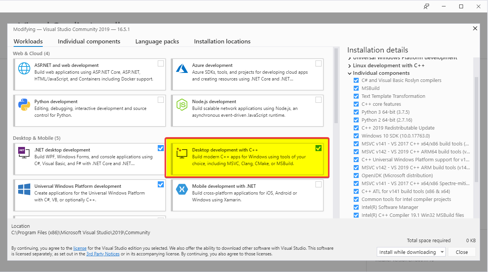

# Remote-PC-Monitoring-Tool
Cross-platform desktop client/server and mobile app to display and monitor PC vitals and stats


# Developer Docs

### [Adding Sensors](docs/AddingSensors.md)

# Build Guide

## Windows:

### Requirements:
* [Git](https://git-scm.com/download/win)
* [Visual Studio 2019](https://visualstudio.microsoft.com/vs/community/) with `Desktop Development with C++` Workload selected: 



### Building:
```
git clone https://github.com/profezzional/Remote-PC-Monitoring-Tool
cd Remote-PC-Monitoring-Tool
build.bat
```


## Linux/OSX:

### Requirements:
* Git (`sudo apt install git`)
* CMake (`sudo apt install cmake`)
* Make (`sudo apt install make`)
* G++ (`sudo apt install g++`)

### Building:
```
git clone https://github.com/profezzional/Remote-PC-Monitoring-Tool
cd Remote-PC-Monitoring-Tool
chmod +X ./build.sh
./build.sh
```