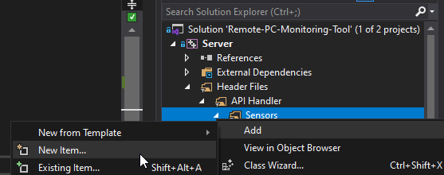

# Adding Sensors

1. Right click the `Sensors` filter, add a new file 



2. Select `Header File (.h)`, and give it a name.
3. Copy the contents of `PlaceholderSensor.hpp` into your new file.

```cpp
#pragma once
#include "Sensor.hpp"

// copy/paste this class for new sensors
// then, in SensorApi.cpp, include your new file, and add an instance of your sensor to g_sensors

class PlaceholderSensor /* <- Rename this */: public Sensor
{
public:
	std::string_view getName() override
	{
		return "placeholder"; // <- Rename this
	}

	std::string_view getPrettyName() override
	{
		return "Placeholder Sensor"; // <- Rename this
	}
	
	UnitEnum getUnit() override
	{
		return UnitEnum::Percentage; // <- Set the unit that you'll be returnning
	}
	
	nlohmann::json getValue() override 
	{
		nlohmann::json j;
		j["value"] = 0.125; // <- your output return value here
		j["success"] = true; // <- set to true if returning a valid result
		return j;
	}

	std::string_view getDesc() override
	{
		return "Doesn't actually do anything..."; // <- Add a discription
	}
};
```
4. Rename where the above comments are, and add your code to `getValue()`.
5. Open `SensorApi.cpp`, and `#include` your sensor file.
6. Add a new instance of your sensor to the static vector of sensors.

```cpp
// include your sensors here
#include "PlaceholderSensor.hpp"
#include "CPUUsageSensor.hpp"
#include "MemoryUtilizationSensor.hpp"
#include "CPUTemperature.hpp"
#include "GPUUsageSensor.hpp"
#include "GPUTemperatureSensor.hpp"
#include "MyNewSensor.hpp" // <- The header file of your new sensor

// then add them to the vector
std::vector<Sensor*> g_sensors = {
	new PlaceholderSensor(),
	new CPUUsageSensor(),
	new MemoryUtilizationSensor(),
	new CPUTemperatureSensor(),
	new GPUUsageSensor(),
	new GPUTemperatureSensor(),
    new MyNewSensor(), // <- The class name of your new sensor
};
```